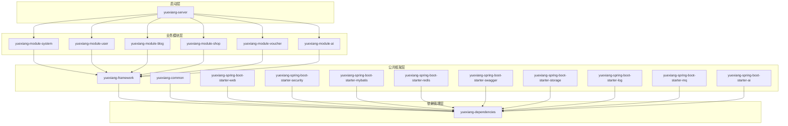

# 悦享生活平台后端工程 Code Wiki

## 1. 项目概览

悦享生活平台后端工程是一个基于 **Java 17 + Spring Boot 3** 的多模块单体应用，采用 Maven 多模块方式组织代码，覆盖认证、用户中心、探店笔记、商户搜索、优惠券/秒杀、AI 探店等核心业务。

### 1.1 项目定位

- 按业务域拆分的单体多模块架构
- 以 `yuexiang-server` 作为统一启动入口
- 以 `yuexiang-framework` 提供公共基础设施能力
- 以 `yuexiang-module-*` 承载各业务域实现
- 业务模块普遍采用 `api` / `biz` 分层，便于复用和边界隔离

### 1.2 核心业务能力

- **系统与认证**：图形验证码、短信验证码发送、短信登录/密码登录、Token 刷新、登出、上传等
- **用户中心**：我的优惠券、我的订单、我的笔记、我的收藏、浏览足迹、签到与签到日历、AI 探店记录
- **探店笔记**：笔记发布、草稿保存与更新、点赞、评论、关注等互动能力、AI 辅助文案能力
- **商户能力**：商户详情、附近商户、商户搜索、商户类型、收藏、点评等互动能力
- **优惠券与秒杀**：普通优惠券能力、店铺券能力、秒杀场次与券列表、秒杀下单、秒杀订单结果查询
- **AI 探店**：AI 普通对话、AI 流式对话（SSE）、会话详情查询、会话删除

## 2. 技术栈

| 类别 | 选型 |
| --- | --- |
| 语言 / 运行时 | Java 17 |
| 应用框架 | Spring Boot 3.2.x |
| ORM | MyBatis-Plus |
| 数据库 | MySQL 8.x |
| 缓存 | Redis / Redisson |
| 搜索 | Elasticsearch 8.x |
| 认证 | JWT |
| API 文档 | Knife4j / OpenAPI |
| AI 能力 | Spring AI + DeepSeek / OpenAI / Qwen |
| 消息队列 | RocketMQ（默认关闭） |
| 对象存储 | MinIO / 阿里云 OSS |

## 3. 项目架构

### 3.1 整体架构

项目采用分层架构，从下到上依次为：

1. **基础设施层**：MySQL、Redis、Elasticsearch、RocketMQ 等
2. **公共框架层**：`yuexiang-framework` 提供的各种 starter
3. **业务模块层**：各个业务域的实现
4. **应用启动层**：`yuexiang-server` 作为统一入口

### 3.2 模块关系



## 4. 目录结构

```text
.
├─ pom.xml                         # 根聚合工程
├─ yuexiang-dependencies/          # 统一依赖与版本管理
├─ yuexiang-framework/             # 公共能力与自定义 starter
│   ├─ yuexiang-common/            # 统一返回体、分页对象、异常、枚举
│   ├─ yuexiang-spring-boot-starter-web/   # Web 通用配置、全局异常处理
│   ├─ yuexiang-spring-boot-starter-security/ # 登录态上下文、JWT 鉴权相关能力
│   ├─ yuexiang-spring-boot-starter-mybatis/ # MyBatis-Plus 配置、基础实体能力
│   ├─ yuexiang-spring-boot-starter-redis/   # Redis 集成
│   ├─ yuexiang-spring-boot-starter-swagger/ # OpenAPI / Knife4j 文档能力
│   ├─ yuexiang-spring-boot-starter-storage/ # 对象存储能力
│   ├─ yuexiang-spring-boot-starter-log/     # 日志能力
│   ├─ yuexiang-spring-boot-starter-mq/      # RocketMQ 集成
│   └─ yuexiang-spring-boot-starter-ai/      # AI 模型统一接入能力
├─ yuexiang-module-system/         # 系统模块
│   ├─ yuexiang-module-system-api/  # 公共 DTO / VO / 领域对象 / 对外接口定义
│   └─ yuexiang-module-system-biz/  # Controller / Service / Mapper / XML / 业务实现
├─ yuexiang-module-user/           # 用户模块
│   ├─ yuexiang-module-user-api/    # 公共 DTO / VO / 领域对象 / 对外接口定义
│   └─ yuexiang-module-user-biz/    # Controller / Service / Mapper / XML / 业务实现
├─ yuexiang-module-blog/           # 笔记模块
│   ├─ yuexiang-module-blog-api/    # 公共 DTO / VO / 领域对象 / 对外接口定义
│   └─ yuexiang-module-blog-biz/    # Controller / Service / Mapper / XML / 业务实现
├─ yuexiang-module-shop/           # 商户模块
│   ├─ yuexiang-module-shop-api/    # 公共 DTO / VO / 领域对象 / 对外接口定义
│   └─ yuexiang-module-shop-biz/    # Controller / Service / Mapper / XML / 业务实现
├─ yuexiang-module-voucher/        # 优惠券 / 秒杀模块
│   ├─ yuexiang-module-voucher-api/ # 公共 DTO / VO / 领域对象 / 对外接口定义
│   └─ yuexiang-module-voucher-biz/ # Controller / Service / Mapper / XML / 业务实现
├─ yuexiang-module-ai/             # AI 探店模块
│   ├─ yuexiang-module-ai-api/      # 公共 DTO / VO / 领域对象 / 对外接口定义
│   └─ yuexiang-module-ai-biz/      # Controller / Service / Mapper / XML / 业务实现
├─ yuexiang-server/                # 应用启动模块
│   └─ src/main/java/com/yuexiang/server/YueXiangApplication.java # 启动入口
└─ docs/                           # 业务与接口设计文档
    ├─ api/                        # API 文档
    ├─ architecture/               # 架构文档
    ├─ design/                     # 设计文档
    ├─ docker/                     # Docker 部署文档
    └─ sql/                        # SQL 脚本
```

## 5. 核心模块说明

### 5.1 公共框架层

#### 5.1.1 yuexiang-common

- **功能**：提供统一返回体、分页对象、异常、枚举等基础组件
- **核心类**：
  - `CommonResult<T>`：统一响应结构
  - `PageParam`：分页参数
  - `PageResult<T>`：分页结果
  - `ResultCodeEnum`：响应码枚举
  - 各种异常类：`BaseException`、`BusinessException`、`UnauthorizedException` 等

#### 5.1.2 yuexiang-spring-boot-starter-web

- **功能**：Web 通用配置、全局异常处理
- **核心类**：
  - `YueXiangWebAutoConfiguration`：Web 自动配置

#### 5.1.3 yuexiang-spring-boot-starter-security

- **功能**：登录态上下文、JWT 鉴权相关能力
- **核心类**：
  - `UserContext`：用户上下文，用于获取当前登录用户信息

#### 5.1.4 yuexiang-spring-boot-starter-mybatis

- **功能**：MyBatis-Plus 配置、基础实体能力
- **核心配置**：
  - 自动配置 MyBatis-Plus
  - 支持逻辑删除与乐观锁

#### 5.1.5 yuexiang-spring-boot-starter-redis

- **功能**：Redis 集成
- **核心配置**：
  - 自动配置 Redis 连接

#### 5.1.6 yuexiang-spring-boot-starter-ai

- **功能**：AI 模型统一接入能力
- **核心配置**：
  - 支持 DeepSeek、OpenAI、Qwen 等模型
  - 提供统一的 AI 调用接口

### 5.2 业务模块层

#### 5.2.1 yuexiang-module-system

- **功能**：认证、验证码、上传等系统级能力
- **核心控制器**：
  - `AuthController`：处理认证相关请求
  - `UploadController`：处理文件上传
- **核心服务**：
  - `AuthService`：认证服务
  - `CaptchaService`：验证码服务
- **核心工具**：
  - `TokenUtil`：Token 工具
  - `PasswordUtil`：密码工具
  - `ValidationUtil`：验证工具

#### 5.2.2 yuexiang-module-user

- **功能**：个人中心、签到、消息、浏览足迹等用户域能力
- **核心控制器**：
  - `UserCenterController`：用户中心
  - `UserProfileController`：用户资料
  - `SignController`：签到
  - `UserAccountController`：用户账户
  - `UserMessageController`：用户消息
- **核心服务**：
  - `SignService`：签到服务
  - `UserMessageService`：用户消息服务
- **核心支持**：
  - `SignCacheSupport`：签到缓存支持
  - `SignComputeSupport`：签到计算支持
  - `UserPointsAccountSupport`：用户积分账户支持

#### 5.2.3 yuexiang-module-blog

- **功能**：探店笔记发布、互动、AI 辅助内容
- **核心控制器**：
  - `BlogController`：笔记管理
  - `BlogPublishController`：笔记发布
  - `BlogLikeController`：笔记点赞
  - `BlogSupportController`：笔记支持
  - `AiBlogController`：AI 辅助
  - `FollowController`：关注
- **核心服务**：
  - `BlogService`：笔记服务
  - `BlogPublishService`：笔记发布服务
  - `BlogLikeService`：笔记点赞服务
  - `AiBlogService`：AI 辅助服务
  - `FollowService`：关注服务
- **核心任务**：
  - `LikeCountReconcileTask`：点赞数对账任务

#### 5.2.4 yuexiang-module-shop

- **功能**：商户详情、附近商户、搜索、收藏、点评
- **核心控制器**：
  - `ShopController`：商户管理
  - `ShopListController`：商户列表
  - `ShopSearchController`：商户搜索
  - `ShopTypeController`：商户类型
  - `FavoriteController`：收藏
  - `ReviewController`：点评
- **核心服务**：
  - `ShopService`：商户服务
  - `ShopListService`：商户列表服务
  - `ShopSearchService`：商户搜索服务
  - `NearbyShopQueryService`：附近商户查询服务
  - `FavoriteService`：收藏服务
  - `ReviewService`：点评服务
- **核心支持**：
  - `GeoRateLimiter`：地理速率限制
  - `ShopDetailSupport`：商户详情支持

#### 5.2.5 yuexiang-module-voucher

- **功能**：优惠券、秒杀、订单相关能力
- **核心控制器**：
  - `VoucherController`：优惠券管理
  - `ShopVoucherController`：店铺优惠券
  - `SeckillController`：秒杀
  - `VoucherOrderController`：优惠券订单
  - `PayCallbackController`：支付回调
- **核心服务**：
  - `VoucherService`：优惠券服务
  - `ShopVoucherService`：店铺优惠券服务
  - `SeckillService`：秒杀服务
  - `VoucherOrderService`：优惠券订单服务
- **核心支持**：
  - `SeckillCacheService`：秒杀缓存服务
  - `SeckillRedisSupport`：秒杀 Redis 支持
  - `VoucherOrderStockSupport`：优惠券订单库存支持
- **核心任务**：
  - `SeckillPreheatTask`：秒杀预热任务
  - `SeckillRetryTask`：秒杀重试任务
  - `OrderTimeoutTask`：订单超时任务

#### 5.2.6 yuexiang-module-ai

- **功能**：AI 探店对话与会话管理
- **核心控制器**：
  - `AiShopController`：AI 探店助手
- **核心服务**：
  - `AiConversationService`：AI 对话服务
  - `AiSessionService`：AI 会话服务
  - `AiMessageService`：AI 消息服务
  - `AiShopService`：AI 店铺服务
  - `AiSseService`：AI 流式服务
- **核心功能**：
  - `AiFunctionConfig`：AI 函数配置
  - 各种 AI 请求/响应对象

## 6. 核心 API/类/函数

### 6.1 公共框架层

#### 6.1.1 CommonResult<T>

```java
public static <T> CommonResult<T> success(T data) { ... }
public static CommonResult<Void> success() { ... }
public static <T> CommonResult<T> error(ResultCodeEnum errorCode) { ... }
public static <T> CommonResult<T> error(int code, String msg) { ... }
```
- **功能**：统一响应结构，用于所有 API 返回
- **参数**：
  - `data`：响应数据
  - `errorCode`：错误码枚举
  - `code`：错误码
  - `msg`：错误消息
- **返回值**：封装后的响应对象

#### 6.1.2 UserContext

```java
public static UserInfo get() { ... }
public static Long getUserId() { ... }
```
- **功能**：获取当前登录用户信息
- **返回值**：
  - `get()`：返回用户信息对象
  - `getUserId()`：返回用户 ID

### 6.2 业务模块层

#### 6.2.1 AuthService

```java
public LoginResult loginBySms(String phone, String smsCode) { ... }
public LoginResult loginByPassword(String phone, String password) { ... }
public void logout() { ... }
public void refreshToken() { ... }
```
- **功能**：处理用户认证相关逻辑
- **参数**：
  - `phone`：手机号
  - `smsCode`：短信验证码
  - `password`：密码
- **返回值**：
  - `LoginResult`：登录结果，包含 token 和用户信息

#### 6.2.2 SignService

```java
public SignResult sign() { ... }
public SignCalendarVO getSignCalendar(int year, int month) { ... }
public SignResult repairSign(int date) { ... }
```
- **功能**：处理用户签到相关逻辑
- **参数**：
  - `year`：年份
  - `month`：月份
  - `date`：日期
- **返回值**：
  - `SignResult`：签到结果
  - `SignCalendarVO`：签到日历

#### 6.2.3 BlogPublishService

```java
public BlogVO publish(BlogPublishDTO publishDTO) { ... }
public BlogVO saveDraft(BlogPublishDTO publishDTO) { ... }
public BlogVO updateDraft(BlogPublishDTO publishDTO) { ... }
```
- **功能**：处理笔记发布相关逻辑
- **参数**：
  - `publishDTO`：发布数据
- **返回值**：
  - `BlogVO`：笔记信息

#### 6.2.4 ShopService

```java
public ShopDetailVO getShopDetail(Long shopId) { ... }
public List<ShopTypeVO> getShopTypes() { ... }
```
- **功能**：处理商户相关逻辑
- **参数**：
  - `shopId`：商户 ID
- **返回值**：
  - `ShopDetailVO`：商户详情
  - `List<ShopTypeVO>`：商户类型列表

#### 6.2.5 SeckillService

```java
public SeckillResult seckill(Long voucherId) { ... }
public SeckillStatusVO getSeckillStatus(String orderNo) { ... }
public List<SeckillSessionVO> getSeckillSessions() { ... }
public List<SeckillVoucherVO> getSeckillVouchers(Long sessionId) { ... }
```
- **功能**：处理秒杀相关逻辑
- **参数**：
  - `voucherId`：优惠券 ID
  - `orderNo`：订单号
  - `sessionId`：场次 ID
- **返回值**：
  - `SeckillResult`：秒杀结果
  - `SeckillStatusVO`：秒杀状态
  - `List<SeckillSessionVO>`：秒杀场次列表
  - `List<SeckillVoucherVO>`：秒杀优惠券列表

#### 6.2.6 AiConversationService

```java
public AiMessageVO chat(AiChatRequest request) { ... }
public SseEmitter streamChat(AiChatRequest request) { ... }
public List<AiSessionVO> getSessions() { ... }
public List<AiMessageVO> getSessionMessages(Long sessionId) { ... }
public void deleteSession(Long sessionId) { ... }
```
- **功能**：处理 AI 对话相关逻辑
- **参数**：
  - `request`：AI 聊天请求
  - `sessionId`：会话 ID
- **返回值**：
  - `AiMessageVO`：AI 消息
  - `SseEmitter`：流式响应
  - `List<AiSessionVO>`：会话列表
  - `List<AiMessageVO>`：会话消息列表

## 7. 依赖关系

### 7.1 模块依赖

| 模块 | 依赖 |
| --- | --- |
| yuexiang-server | yuexiang-module-system<br>yuexiang-module-user<br>yuexiang-module-blog<br>yuexiang-module-shop<br>yuexiang-module-voucher<br>yuexiang-module-ai |
| yuexiang-module-system | yuexiang-framework |
| yuexiang-module-user | yuexiang-framework |
| yuexiang-module-blog | yuexiang-framework |
| yuexiang-module-shop | yuexiang-framework |
| yuexiang-module-voucher | yuexiang-framework |
| yuexiang-module-ai | yuexiang-framework |
| yuexiang-framework | yuexiang-dependencies |

### 7.2 技术依赖

| 依赖 | 版本 | 用途 |
| --- | --- | --- |
| Spring Boot | 3.2.x | 应用框架 |
| MyBatis-Plus | 最新版本 | ORM 框架 |
| Redis | 6.x / 7.x | 缓存 |
| Elasticsearch | 8.x | 搜索 |
| JWT | 最新版本 | 认证 |
| Knife4j | 最新版本 | API 文档 |
| Spring AI | 最新版本 | AI 能力集成 |
| RocketMQ | 最新版本 | 消息队列 |

## 8. 配置说明

### 8.1 主配置文件

- **路径**：`yuexiang-server/src/main/resources/application.yml`
- **主要配置项**：
  - 服务端口：`8080`
  - MySQL 数据源
  - Redis 连接
  - Elasticsearch 连接
  - RocketMQ 开关
  - AI 模型配置
  - 业务规则配置

### 8.2 环境变量覆盖

```bash
MYSQL_URL=jdbc:mysql://localhost:3306/yuexiang?useUnicode=true&characterEncoding=utf-8&serverTimezone=Asia/Shanghai
MYSQL_USERNAME=root
MYSQL_PASSWORD=123456
REDIS_HOST=127.0.0.1
REDIS_PORT=6379
REDIS_DATABASE=0
ES_URIS=http://localhost:9200
DEEPSEEK_API_KEY=your-api-key
OPENAI_API_KEY=your-api-key
QWEN_API_KEY=your-api-key
```

### 8.3 配置建议

- 不要在仓库中提交真实数据库密码、Redis 密码或 AI 密钥
- 本地开发优先使用环境变量覆盖敏感配置
- AI 模型配置建议仅保留占位值，真实密钥通过运行环境注入

## 9. 项目运行方式

### 9.1 编译项目

在项目根目录执行：

```bash
mvn clean package -DskipTests
```

### 9.2 启动应用

#### 方式一：直接使用 Maven 启动

```bash
mvn -pl yuexiang-server -am spring-boot:run
```

#### 方式二：打包后运行

```bash
java -jar yuexiang-server/target/yuexiang-server-1.0.0-SNAPSHOT.jar
```

### 9.3 验证服务是否启动成功

默认访问地址：

- `http://localhost:8080`

若 Knife4j 保持开启，通常可通过以下地址查看接口文档：

- `http://localhost:8080/doc.html`

## 10. 开发指南

### 10.1 接口返回结构

项目统一使用 `CommonResult<T>` 作为接口响应包装。

### 10.2 登录态获取方式

业务代码通常通过 `UserContext` 获取当前用户：

- 匿名可访问接口：优先判断 `UserContext.get()` 是否为空
- 必须登录接口：直接使用 `UserContext.getUserId()`

### 10.3 持久层约定

- 使用 MyBatis-Plus + Mapper XML
- 通用实体通常继承 `BaseEntity`
- 默认支持逻辑删除与乐观锁字段

### 10.4 典型请求链路

```text
Controller -> Service -> Mapper -> MySQL / Redis / Elasticsearch / AI Provider
```

### 10.5 代码阅读建议

如果你是第一次接手该项目，建议按如下顺序阅读：

1. `pom.xml`
2. `yuexiang-server/`
3. `yuexiang-framework/`
4. 当前负责的业务模块
5. 对应的 `docs/api` 文档

## 11. 监控与维护

### 11.1 日志配置

- 日志级别：默认 `root: info`, `com.yuexiang: debug`
- 日志文件：根据部署环境配置

### 11.2 常见问题

| 问题 | 可能原因 | 解决方案 |
| --- | --- | --- |
| 登录失败 | 验证码错误、密码错误、账号锁定 | 检查输入、解锁账号 |
| 秒杀失败 | 库存不足、请求过于频繁 | 检查库存、限制请求频率 |
| AI 对话失败 | API Key 错误、模型服务不可用 | 检查 API Key、切换模型 |
| 商户搜索失败 | Elasticsearch 未启动 | 启动 Elasticsearch |

## 12. 最佳实践

### 12.1 代码规范

- 遵循 Java 代码规范
- 使用 Lombok 简化代码
- 合理使用设计模式
- 保持代码简洁清晰

### 12.2 性能优化

- 使用 Redis 缓存热点数据
- 合理使用索引
- 避免 N+1 查询
- 优化 SQL 语句

### 12.3 安全措施

- 使用 HTTPS
- 密码加密存储
- 防止 SQL 注入
- 防止 XSS 攻击
- 防止 CSRF 攻击

## 13. 未来规划

### 13.1 架构演进

- 考虑微服务拆分
- 引入服务网格
- 加强监控与告警

### 13.2 功能扩展

- 增加更多 AI 能力
- 优化推荐算法
- 增加社交功能
- 支持多语言

### 13.3 技术升级

- 升级 Spring Boot 版本
- 引入新的技术栈
- 优化系统性能

## 14. 附录

### 14.1 业务文档索引

- [个人中心](docs/api/user/个人中心.md)
- [发布笔记页](docs/api/blog/发布笔记页.md)
- [优惠券模块API接口文档](docs/api/优惠券模块API接口文档.md)
- [AI 探店助手](docs/api/ai/AI 探店助手.md)

### 14.2 数据库脚本

- [ai_phase1_migration.sql](docs/sql/ai_phase1_migration.sql)
- [data.sql](docs/sql/data.sql)
- [insert_test_user.sql](docs/sql/insert_test_user.sql)
- [sign_tables.sql](docs/sql/sign_tables.sql)
- [tb_user_message.sql](docs/sql/tb_user_message.sql)
- [test.sql](docs/sql/test.sql)

### 14.3 配置说明

- [配置说明](docs/配置说明.md)

### 14.4 模块边界规则

- [模块边界规则](docs/architecture/module-boundary-rules.md)

## 15. 总结

悦享生活平台后端工程是一个功能完整、架构清晰的多模块单体应用，采用了现代 Java 技术栈，覆盖了多种核心业务能力。通过本文档的介绍，希望能够帮助开发者快速了解项目结构、核心功能和开发流程，从而更好地参与到项目开发中来。

项目的优势在于：

- 模块边界清晰，便于维护和扩展
- 公共能力沉淀在 framework 层，避免重复代码
- 启动与部署保持单体应用的简单性
- 后续如果需要做服务拆分，可以基于现有模块边界继续演进

通过不断的优化和扩展，相信悦享生活平台后端工程会变得更加完善和强大。